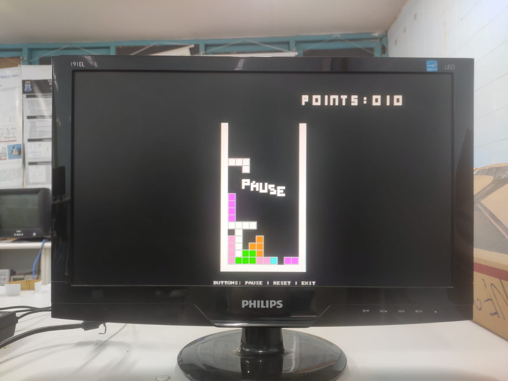
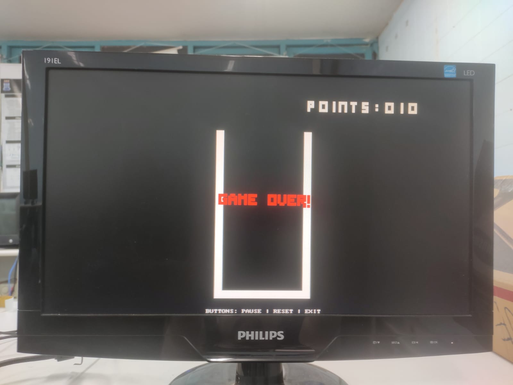

# Jogo de Tetris no DE1-SoC

## Descrição
Este projeto envolve o desenvolvimento de um jogo de Tetris para a placa de desenvolvimento DE1-SoC. O jogo é controlado usando o acelerômetro para o movimento, botões da DE1-SoC para navegação no menu e utiliza a interface VGA para visualização do jogo. O sistema é projetado para ser uma demonstração abrangente da interação hardware-software utilizando as capacidades da DE1-SoC.

## Índice
1. [Descrição](#descrição)
2. [Objetivos](#objetivos)
3. [Requisitos](#requisitos)
4. [Configuração de Hardware](#configuração-de-hardware)
5. [Como Compilar e Executar](#como-compilar-e-executar)
6. [Imagens](#imagens)
7. [Testes](#testes)
8. [Funcionamento do Acelerômetro e Botões](#funcionamento-do-acelerômetro-e-botões)
9. [Análise Final](#análise-final)
10. [Materiais de Pesquisa Adicionais](#materiais-de-pesquisa-adicionais)

## Objetivos
- Aplicar o conhecimento de interação hardware-software para desenvolver um jogo funcional.
- Programar em C para arquitetura ARM.
- Compreender a gestão do sistema operacional Linux em ARM.
- Utilizar eficazmente as interfaces da placa DE1-SoC.

## Requisitos
- Placa de Desenvolvimento DE1-SoC
- Acelerômetro (ADXL345)
- Monitor VGA
- Botões e LEDs
- Sistema Operacional Linux (preferencialmente rodando em arquitetura ARM)
- Conhecimento básico de programação em C e interfaceamento de hardware

## Configuração de Hardware
### Placa DE1-SoC
  - **CPU**: ARM Cortex-A9
  - **Memória**: 1GB DDR3
  - **Saída de Vídeo**: VGA
  - **Entrada**: Acelerômetro, botões

### Conexões
1. **Monitor VGA**: Conectar à saída VGA da DE1-SoC.
2. **Acelerômetro**: Conectar à interface I2C.
3. **Display de 7 Segmentos**: Conectar à interface do display HEX.
4. **Botões**: Conectar ao GPIO para entrada do usuário.
5. **LEDs**: Conectar ao GPIO para indicação de status.

## Como Compilar e Executar
1. **Clonar o Repositório**:
    ```bash
    git clone https://github.com/alexsami-lopes/Digital-Systems-Tetris.git
    cd Digital-Systems-Tetris-main
    ```

2. **Compilar o Código**:
    ```bash
    make
    ```

3. **Executar o Jogo**:
    ```bash
    sudo ./tetris
    ```

   Certifique-se de ter as permissões necessárias para acessar `/dev/mem`.

## Imagens
### Placa DE1-SoC e Configuração de Hardware


### Tela VGA Mostrando o Jogo



<p align="center">
  
</p>

## Testes
Durante a fase de testes, os seguintes passos foram realizados:
1. Verificadas as conexões entre a DE1-SoC e os periféricos (VGA).
2. Garantido que o jogo responde corretamente aos inputs do acelerômetro para movimento das peças.
3. Testados os botões para funções de controle do jogo (pausar, retomar, resetar e sair).
4. Verificada a saída visual do jogo no monitor VGA e garantido que não há problemas gráficos.

## Funcionamento do Acelerômetro e Botões

### Acelerômetro (ADXL345)
O acelerômetro ADXL345 é usado para detectar a orientação da placa DE1-SoC e controlar o movimento das peças do Tetris. Ele está conectado à interface I2C da DE1-SoC e configurado para operar no modo ±16 g com uma taxa de amostragem de 100 Hz. Os dados do acelerômetro são lidos periodicamente para determinar a direção de movimento das peças do Tetris. Por exemplo, inclinar a placa para trás acelera a queda das peças, enquanto inclinar para a esquerda ou direita move as peças na direção correspondente.

#### Acesso ao Acelerômetro ADXL345 Usando I2C0

Para acessar o acelerômetro ADXL345 na DE1-SoC via I2C0 sem utilizar um driver, siga estes passos:

1. **Inicializar o I2C0**: Utilize `mmap()` para mapear o endereço base do I2C0 (`0xFFC04000`) no espaço de memória do programa.

2. **Configurar o ADXL345**: Escreva os seguintes valores nos registradores do ADXL345 para o modo de ±16g e amostragem de 100 Hz:
   - Controle de Potência (`0x2D`): `0x08` (modo de medição)
   - Formato de Dados (`0x31`): `0x0B` (resolução total, ±16g)
   - Taxa de Banda (`0x2C`): `0x0A` (100 Hz)

3. **Ler Dados do Acelerômetro**: Recupere os valores de aceleração dos registradores `0x32` a `0x37` para os eixos X, Y e Z, combinando os bytes alto e baixo.

4. **Processar os Dados**: Utilize os dados dos eixos X e Y para controlar o movimento das peças do Tetris na tela.

5. **Manuseio Opcional de Interrupções**: Ative interrupções de atividade/inatividade escrevendo nos registradores **Interrupt Enable Register** (`0x2E`) e **Activity Control Register** (`0x27`).

Este método permite a comunicação direta com o acelerômetro, fornecendo controle sobre sua configuração e leitura de dados sem auxílio de bibliotecas externas.

### Botões
Os botões da placa DE1-SoC são usados para controlar as funções do jogo. As respostas dos botões são detectadas usando o driver intelfpgaup/KEY.h. Cada botão está mapeado na memória e os três primeiros executam ações específicas no jogo:
- **Botão Pausar**: Pausa o jogo quando pressionado. (primeiro botão)
- **Botão Retomar**: Retoma o jogo após ter sido pausado. (primeiro botão, após a pausa)
- **Botão Resetar**: Reseta o jogo para o estado inicial. (segundo botão, apenas quando o jogo acaba)
- **Botão Sair**: Sai do jogo. (terceiro botão)

As pressões nos botões são detectadas e registradas na memória mapeada, e a ação correspondente no jogo é disparada. A lógica do jogo lida com o debounce para garantir a detecção precisa dos botões.

## Análise Final
O projeto demonstrou com sucesso a integração de hardware e software na placa DE1-SoC. Os principais resultados de aprendizagem incluem o manuseio de interfaces de hardware, a gestão da lógica de jogo em tempo real e o desenvolvimento de um sistema de jogo completo usando programação em C. Melhorias futuras poderiam incluir o refinamento dos controles do jogo e a adição de mais funcionalidades.

## Materiais de Pesquisa Adicionais
- [Manual do Usuário DE1-SoC](datasheets/user_manual.pdf)
- [Datasheet do Acelerômetro ADXL345](datasheets/Accelerometer.pdf)
- [Material de base de pesquisa do Acelerômetro](https://github.com/VimfulDang/ADXL345-Accelerometer-DE1-SOC/tree/master)
- [Retornar ao Índice](#índice)
