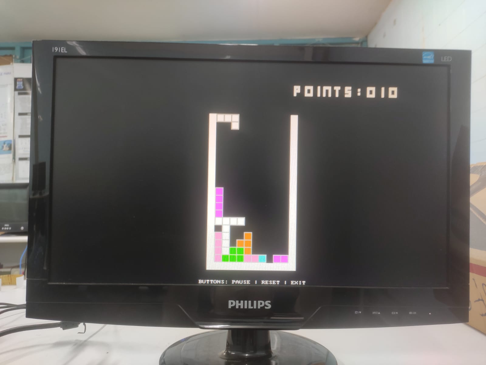

# [Versão em Português (Brasil)](README-PTbr.md)


---
# Tetris Game on DE1-SoC

## Description
This project involves developing a Tetris game for the DE1-SoC development board. The game is controlled using the accelerometer for movement, DE1-SoC buttons for menu navigation, and utilizes the VGA interface for game visualization. The system is designed to be a comprehensive demonstration of hardware-software interaction using the DE1-SoC's capabilities.

## Table of Contents
1. [Description](#description)
2. [Objectives](#objectives)
3. [Requirements](#requirements)
4. [Hardware Setup](#hardware-setup)
5. [How to Compile and Run](#how-to-compile-and-run)
6. [Images](#images)
7. [Testing](#testing)
8. [Accelerometer and Buttons Functionality](#accelerometer-and-buttons-functionality)
9. [Final Analysis](#final-analysis)
10. [Additional Research Material](#additional-research-material)

## Objectives
- Apply hardware-software interaction knowledge to develop a functional game.
- Program in C for ARM architecture.
- Understand Linux OS management on ARM architecture.
- Utilize the DE1-SoC board's interfaces effectively.

## Requirements
- DE1-SoC Development Board
- Accelerometer (ADXL345)
- VGA Monitor
- Push Buttons and LEDs
- Linux OS (preferably running on ARM architecture)
- Basic knowledge of C programming and hardware interfacing

## Hardware Setup
### DE1-SoC Board
  - **CPU**: ARM Cortex-A9
  - **Memory**: 1GB DDR3
  - **Video Output**: VGA
  - **Input**: Accelerometer, push buttons

### Connections
1. **VGA Monitor**: Connect to the VGA output of the DE1-SoC.
2. **Accelerometer**: Connect to I2C interface.
3. **7-Segment Display**: Connect to the HEX display interface.
4. **Push Buttons**: Connect to GPIO for user input.
5. **LEDs**: Connect to GPIO for status indication.

## How to Compile and Run
1. **Clone the Repository**:
    ```bash
    git clone https://github.com/alexsami-lopes/Digital-Systems-Tetris.git
    cd Digital-Systems-Tetris
    ```

2. **Compile the Code**:
    ```bash
    make
    ```

3. **Run the Game**:
    ```bash
    sudo ./tetris
    ```

   Ensure that you have the necessary permissions to access `/dev/mem`.

## Images
### DE1-SoC Board and Hardware Setup


### VGA Display Showing the Game



<p align="center">
  
</p>


## Testing
During the testing phase, the following steps were taken:
1. Verified connections between the DE1-SoC and peripherals (VGA).
2. Ensured the game correctly responds to accelerometer inputs for piece movement.
3. Tested push buttons for game control functions (pause, resume, reset and exit).
4. Verified the game's visual output on the VGA monitor and ensured no graphical issues.

## Accelerometer and Buttons Functionality

### Accelerometer (ADXL345)
The ADXL345 accelerometer is used to detect the orientation of the DE1-SoC board and control the movement of Tetris pieces. The accelerometer is connected to the I2C interface of the DE1-SoC and is configured to operate in ±16 g mode with a 100 Hz sampling rate. The data from the accelerometer is read periodically to determine the movement direction of the Tetris pieces. For instance, tilting the board backward moves the pieces down faster, while tilting left or right, on the x axis, moves the pieces left or right, respectively.

#### Accessing the ADXL345 Accelerometer Using I2C0

To access the ADXL345 accelerometer on the DE1-SoC via I2C0 without using a driver, follow these steps:

1. **Initialize I2C0**: Use `mmap()` to map the I2C0 base address (`0xFFC04000`) into your program’s memory space.

2. **Configure ADXL345**: Write the following values to the ADXL345 registers for ±16g range and 100 Hz sampling:
   - Power Control (`0x2D`): `0x08` (Measurement mode)
   - Data Format (`0x31`): `0x0B` (Full resolution, ±16g)
   - Bandwidth Rate (`0x2C`): `0x0A` (100 Hz)

3. **Read Accelerometer Data**: Retrieve acceleration values from registers `0x32` to `0x37` for X, Y, and Z axes, then combine the low and high bytes.

4. **Process Data**: Use the X and Y axis data to control Tetris piece movement on the screen.

5. **Optional Interrupt Handling**: Enable activity/inactivity interrupts by writing to the **Interrupt Enable Register** (`0x2E`) and **Activity Control Register** (`0x27`).

This approach allows direct communication with the accelerometer, enabling full control over its configuration and data retrieval without aid from external libraries.


### Push Buttons
The DE1-SoC board's push buttons are utilized for controlling game functions. The buttons reponses were detected using the intelfpgaup/KEY.h driver. Each of the buttons is mapped to the memory and the first three are resposible for specific actions in the game:
- **Pause Button**: Pauses the game when pressed. (first button)
- **Resume Button**: Resumes the game after being paused. (first button, after the game is already paused)
- **Reset Button**: Resets the game to the initial state. (second button, only when the game is over)
- **Exit Button**: Exits the game. (third button)

Button presses are detected and registered in the memory mapped, and the corresponding game action is triggered. The game logic handles debouncing to ensure accurate button detection.


## Final Analysis
The project successfully demonstrated the integration of hardware and software on the DE1-SoC board. Key learning outcomes include handling hardware interfaces, managing real-time game logic, and developing a complete game system using C programming. Future improvements could include refining the game's controls and adding more features.

## Additional Research Material
- [DE1-SoC User Manual](datasheets/user_manual.pdf)
- [ADXL345 Accelerometer Datasheet](datasheets/Accelerometer.pdf)

- [Return to Table of Contents](#table-of-contents)
